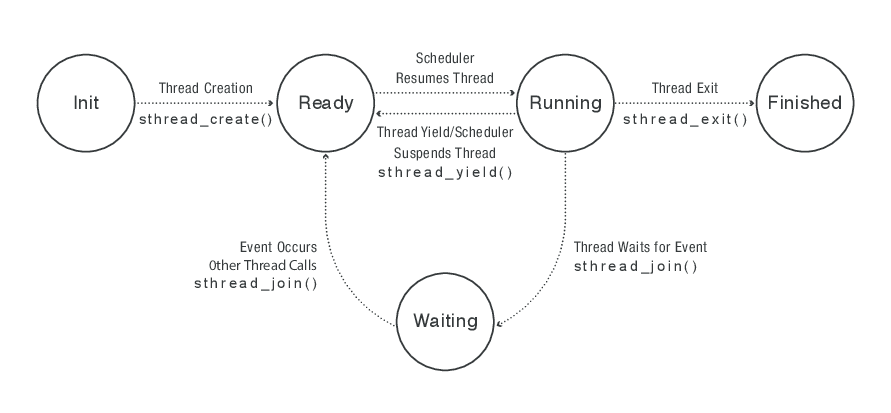

# Introduction to concurrency and threads

## Motivation for threads

We often want several activities in our program to go on at the same
time.

### Particualar example: Google Earth

We have to simultaneously do at least three things:
- Accept input from the user;
- Get packets from the server across the network;
- Render the images we've received from the server.

How do we program this?

### General patterns where this is useful:

- Accepting input from the user.
- Blocking I/O.

## Thread abstraction

One way to write code that keeps multiple activities going on
concurrently is as a set of threads, each threads executing code that
pertaining to a single activity.

A thread is a single execution sequence that represents a separately
schedulable task.

The execution of threaded code is non-deterministic -- it depends on
the scheduler.  As a result, threaded code can be extremely hard to
debug.  In many cases, no amount of testing can convince us that the
code is bug-free.

## Thread data structures

## Thread life-cycle

## Pthreads

### Technical definition of concurrent code

Two instructions are concurrent if we cannot tell by looking at the
source code of the program which of them will be executed first;
otherwise, they are sequential.
