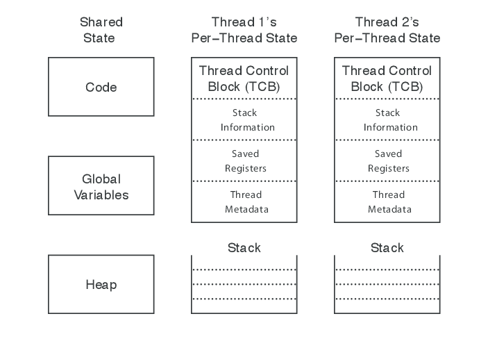

# Introduction to concurrency and threads

## Motivation for threads

We often want several activities in our program to go on at the same
time.

### Particular example: Google Earth

We have to simultaneously do at least three things:
- Accept input from the user;
- Get packets from the server across the network;
- Render the images we've received from the server.

How do we program this?

### General patterns where this is useful:

- Accepting input from the user.
- Blocking I/O.
- Writing code for execution on multi-core architectures.

## Thread abstraction

One way to write code that keeps multiple activities going on
concurrently is as a set of threads, each threads executing code that
pertaining to a single activity.

A thread is a single execution sequence that represents a separately
schedulable task.

The execution of threaded code is non-deterministic -- it depends on
the scheduler.  As a result, threaded code can be extremely hard to
debug.  In many cases, no amount of testing can convince us that the
code is bug-free.

## Thread data structures

In a running program, threads share the code segment, the data
segment, and the heap segment.  Each thread has it's own stack.

Each stack has associated with it a Program Counter value and a Stack
Pointer Value, which are stored in a TCB (Thread Control Block).

## Thread life-cycle

## Pthreads

We will be using the
[Pthreads library](https://en.wikipedia.org/wiki/POSIX_Threads) for
writing threaded code in this course.

Here is a list of resources that you might find useful for learning
how to write code with pthreads:

- [Pthreads tutorial from LLNL](https://computing.llnl.gov/tutorials/pthreads/)
- [An Introduction to Programming with Threads) by Andrew D. Birrel]
   (http://www.cs.wits.ac.za/~dmitry/coms2001/static/resources/035-Threads.pdf)
- Chapters 11 & 12 from W. Richard Stevens and Stephen A. Rago
  [Advanced Programming in the Unix
  Environment](http://www.apuebook.com/), 3d edition (second edition is also fine).

### Technical definition of concurrent code

Two instructions are concurrent if we cannot tell by looking at the
source code of the program which of them will be executed first;
otherwise, they are sequential.
