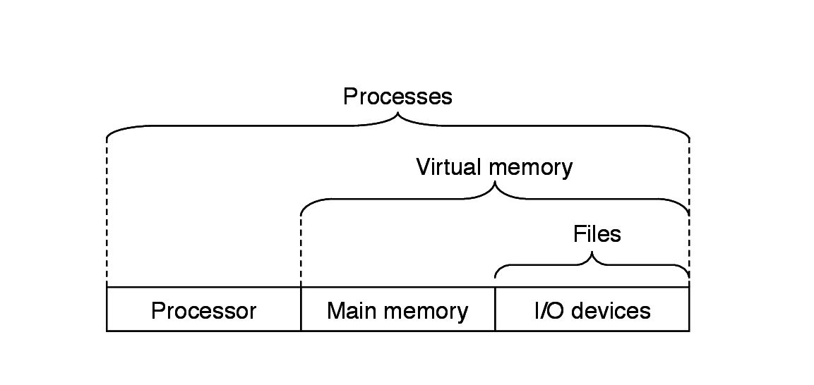
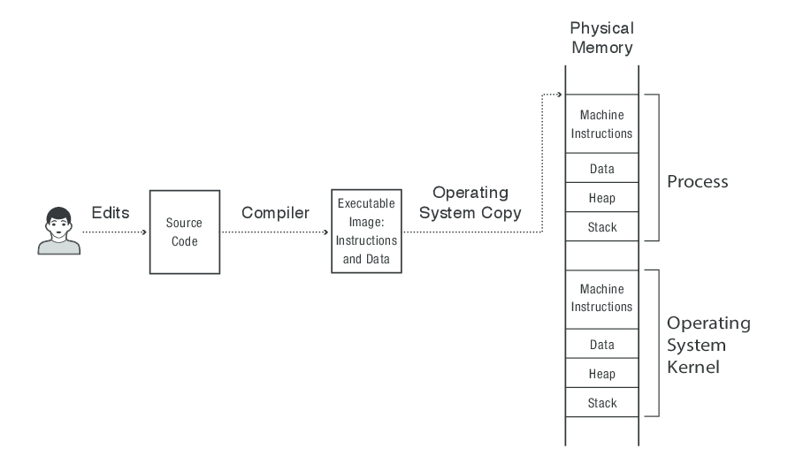
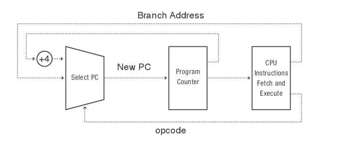
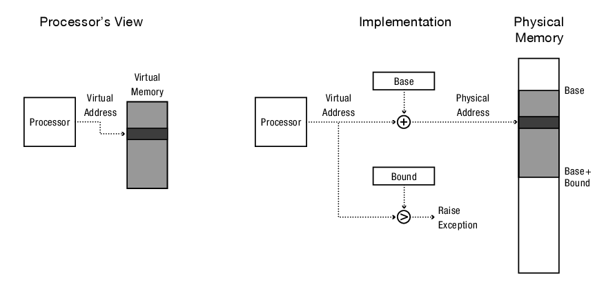
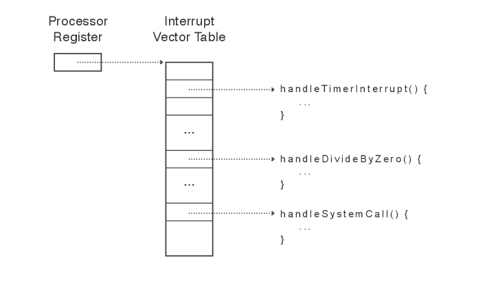

# Introduction to Operating Systems #

## Role of an operating system ##

- "Operating system" has two meanings: (1) the entire suit of software
  that comes with your computer and (2) the kernel; in this class, by
  "operating system" we most of the time mean the kernel.

- An operating system (i.e., the kernel) fundamentally does three
  things:
  1. provides to application programs simple and convenient
  abstractions of and interfaces to hardware (you don't have to worry
  about hardware when you write your applications);
  2. protects applications from each other, hardware from applications,
    and itself from applications (your buggy application cannot
    clobber other applications, the hardware, or the kernel);
  3. provides a way for applications to talk to each other (your
    application can talk to other applications).

- An operating system provides convenient abstractions for hardware
  resources:
  - File systems abstract I/O and persistent storage devices;
  - Virtual memory abstracts main memory as well as I/O and
    persistent storage devices;
  - Processes abstract the CPU as well as the two
    above.
	
- An operating system's protection mechanism provides the basis for
  security in computer systems -- you couldn't write secure
  applications if the operating system was not providing its
  protection services (thus, you can write an application that
  requires a user to enter a password without worrying that another
  application running at the same time will have access to the entered
  password).

- An operating system allows you to write applications that need to
  communicate with other applications.

- Operating systems make advances in hardware available to
  applications (for example, Android and iOS make smart-phone hardware
  available to apps).

- Operating systems are being written for all kinds of hardware
  (phones, cars, buildings, etc.).

- Thanks to an operating system running on a device, you can write an
  application to run on the div-ice
  - without knowing how the div-ice works;
  - without worrying about your application being corrupted by other
    applications or your application corrupting other applications,
    hardware, or the operating system;
  - being able to make your application communicate with other
    applications as needed.

## Why take an Operating Systems class? ##

- It will help you understand how computer systems work by showing you
  how software and hardware interact: you will see that there is no
  magic there.

- Many important core concepts and design patterns used in building
  operating systems come up in all kinds of computer systems. There
  are
  - concurrency;
  - protection;
  - interfaces and hiding complexity;
  - access to contested resources.

- It will make you a better user of an OS by showing you what goes on
  under the hood.

For more, check (this post)[http://blog.regehr.org/archives/164].

## Course structure ##

1. Introduction to main concepts (HW0)
2. Processes (HW1)
3. Concurrency and threads; scheduling
4. Virtual memory (HW2)
5. File systems and persistent storage

- We will pretty closely follow the prescribed textbook; lectures will
  given you sufficient overview for you to be able to read detailed
  explanations in the textbook.

- 3 Homework Assignments: will give you experience with systems
  programming.
- You need a GitHub account to submit homeworks.
- TAs will help you with homeworks.

# Introduction to the Process #

To give you a flavour of what an OS can do for you, we'll explore how
the OS implements protection. In doing so, we will cover the
following:

## Four fundamental OS concepts ##
- **Privileged (Kernel) vs. User Mode (Dual mode operation)**: the
    hardware can run in two distinct modes.
- **Address space**: the memory addresses that an executing program
    sees; these differ from physical addresses of the machine.
- **Process:** an instance of an executing program consisting of an
    address space as well as one or more threads of control.	
- **Protection**:  user programs are protected from each other and the
    OS and hardware are protected from user programs by controlling
    the translation from the program's address space to the physical
    address space of the machine.

## A fundamental OS mechanism ##

- **Context switch**

## Dual mode operation ##

- When a machine runs in the privileged mode, the software has access
   to all the hardware -- this is when the kernel is running.
- When a machine runs in user mode, the access to hardware is
  restricted -- this is when user programmes are running.
- User programs access hardware by issuing a system call to the
  kernel, upon which the machine switches to the kernel mode and the
  kernel carries out the request of the user program.
- Certain instructions are prohibited to be executed in the user mode;
  an exception will be raised if a user program attempts to execute
  such an instruction.

## Address space of a running program ##

- When an executable file for a user program is being loaded into
  memory, the address space for the running instance of the program is
  created and the thread of control is transferred to the user
  program. After that, OS provides services to the running program and
  protects itself and hardware from it.

- Recall: Source file vs. Executable vs. Program in memory

- Address space of the program in memory is made up of four major
  segments: code, data, heap, stack

- Recall: the instruction execution cycle (in computer architecture
  class your thought of it as using physical memory)

- All the addresses that the running program presents to the CPU are
  virtual (they are not related to the physical addresses of bytes in
  RAM); before the CPU can run the instruction, virtual addresses have
  to be translated to physical addresses, so that the CPU knows where
  in physical memory to find the instruction and data to fetch.

## Process: address space plus a thread of control ##

- Thread of control: the state of the program that can be represented
  in the registers (PC, stack pointer, etc. -- depends on the
  architecture) -- a thread is being executed if its state **is**
  represented in the registers.
- A modern OS supports a concurrent execution of multiple processes by
  switching between multiple threads of control (this is called the
  context switch).

## Protection ##

- Protection is achieved through address translation (from virtual
  addresses the process presents to the CPU to physical addresses that
  the CPU uses to fetch instructions and data).
- Simple address translation mechanism -- base and bound:

- This way, no process can access the physical memory allocated to
  other processes or the kernel.

## Context switch ##

- Switching from executing one process to another; includes switching
  between a user process and the kernel
- Three types of mode transfer between a user process and the kernel
  - System call (syscall)
  - Interrupt
  - Trap (exception)
- How does the kernel know which instruction to run upon a switch from a
  user process? -- Interrupt vector:
  

## Linux commands to explore ##

`ps`
